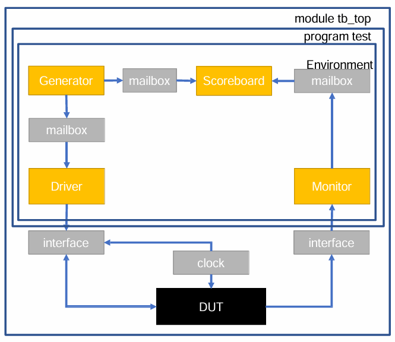
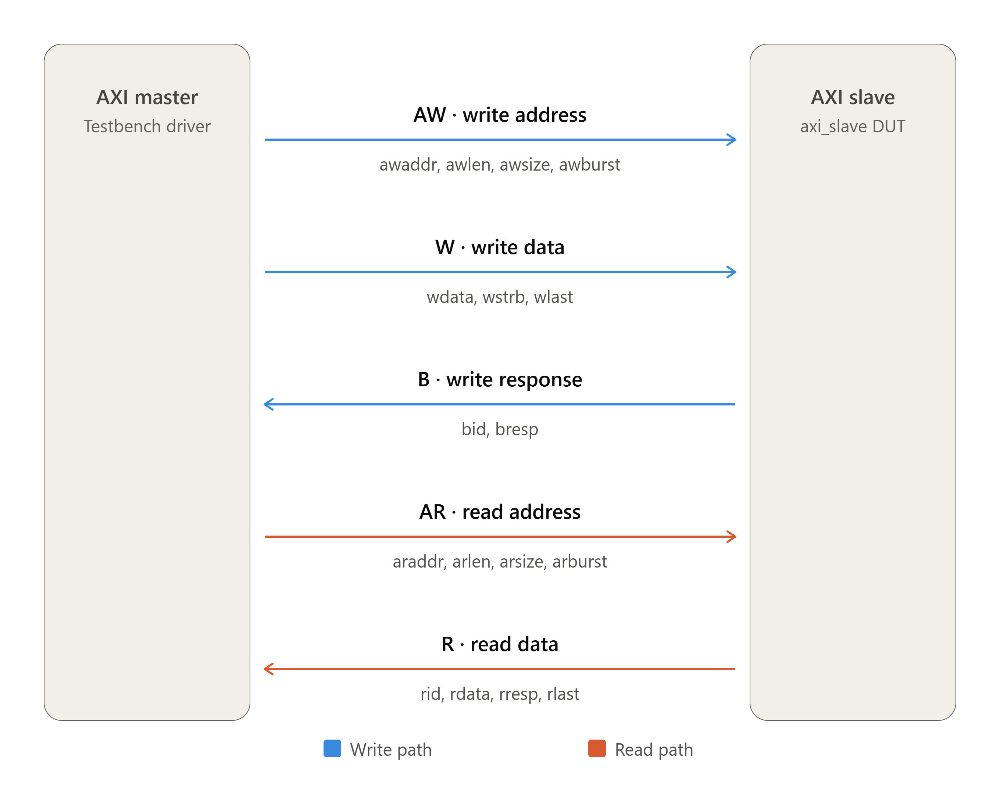

# AXI4-Full Slave Verification (FIXED Burst)

SystemVerilog layered testbench for verifying an AXI4-Full slave supporting FIXED burst modes, following the AMBA AXI4 specification (ARM IHI 0022E).

## Project Overview

- **DUT:** AXI4-Full Slave (128-byte memory, 32-bit data bus, 4-bit ID)
- **Verification:** UVM-style layered testbench (Transaction, Generator, Driver, Monitor, Scoreboard, Environment)
- **Simulator:** Synopsys VCS L-2016.06
- **Waveform:** GTKWave

## Features Verified

- FIXED and WRAP burst types
- Burst lengths: 2, 4, 8, 16 beats
- Burst sizes: 1, 2, 4 bytes/beat
- AW/W/B handshake protocol
- Memory content verification (byte-by-byte scoreboarding)
- Read-back verification (AR/R channels)
- Functional coverage (100% on burst type × length × size cross)

## Files

| File | Role |
|---|---|
| `axi_slave.sv` | DUT (AXI4-Full Slave) |
| `interface.sv` | AXI4 interface with clocking blocks |
| `transaction.sv` | Write transaction class |
| `generator.sv` | Randomized stimulus generator |
| `driver.sv` | Pin-level driver (AW/W/B) |
| `monitor.sv` | Protocol monitor + functional coverage |
| `scoreboard.sv` | Reference model + memory comparison |
| `environment.sv` | Orchestration + read-back check |
| `test.sv` | Top-level test |
| `testbench_top.sv` | Top module |

## Results

- **20+ randomized transactions** — all pass
- **128/128 memory bytes** verified (write + read-back)
- **100% functional coverage**
- **11 DUT bugs** found and fixed (documented in report)

## How to Run

```bash
vcs -sverilog testbench_top.sv axi_slave.sv -full64 -debug_all
./simv

```

## Layered Testbench Architecture



## AXI4 Master-Slave Block Diagram



## DUT Bugs Found & Fixed

During verification, **11 DUT bugs** were found and fixed. Full details in 
📄 [Download Full (PDF)](docs/axi_design_bugs.pdf)
📖 [Read Online (Markdown)](docs/axi_design_bugs.md)

### Summary

| # | Stage | Bug | Fix |
|---|---|---|---|
| 1 | Stage 2 | `always_comb` with `mem` init — VCS compile error | Moved init to reset block |
| 2 | Stage 2 | AW signals not latched | Latched all AW fields on handshake |
| 3 | Stage 2 | `wlen_count` combinational feedback loop | Moved to `always_ff` with `_next` |
| 4 | Stage 2 | `wready` deasserted on `wlast` | Held `wready` through handshake |
| 5 | Stage 2 | `widle` did not check `wvalid` | Added `wvalid && !wlast` guard |
| 6 | Stage 3 | `wready` NBA race | Made combinational |
| 7 | Stage 3 | `bvalid` priority conflict | Added `bready && bvalid` guard |
| 8 | Stage 3 | `wcur_addr` race at last beat | Captured in `W_IDLE` |
| 9 | Stage 4 | Single-byte read replication | Added byte-wise `read_beat()` |
| 10 | Stage 4 | FIXED burst address increment | Added burst-type case |
| 11 | Stage 4 | WRAP burst did not wrap | Added wrap boundary logic |
